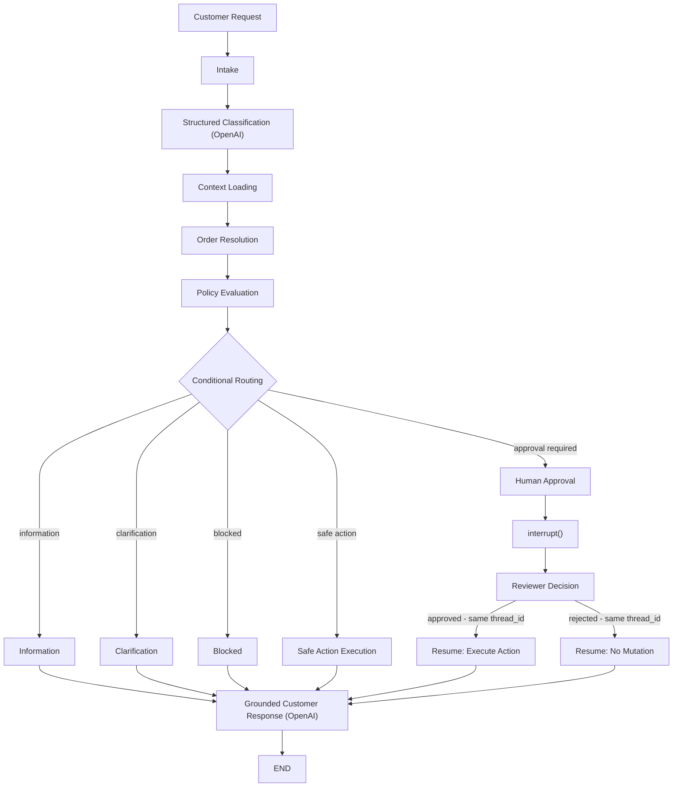

# AI Customer Operations Agent

A stateful customer-operations agent built on **LangGraph**: it classifies a
customer request, resolves it against real order data, applies deterministic
business policy, executes safe actions automatically, and pauses for
**human approval** before anything sensitive - all with a grounded final
response and a curated end-to-end evaluation suite. This is a portfolio
project, not production software.

> Mercora is a fictional e-commerce company invented for this project. All
> customers, orders, policies, payments, addresses, and tickets referenced
> anywhere in this repository are synthetic and do not represent any real
> business or individual. All data in `data/` is fabricated for this project.

## Live Demo

Public Streamlit demo: deployment pending. (This line will be replaced with
a real URL after manual deployment to Streamlit Community Cloud.)

## Why This Project

Customer operations requests mix two very different kinds of problems: understanding
what the customer actually wants (a language problem) and deciding what is
*allowed to happen* (an operational, policy-governed problem). This project
is a portfolio-scale demonstration of keeping those cleanly separated:

- interpreting a free-text request needs language understanding
- resolving it against real customer/order data needs deterministic lookups
- deciding whether an action is eligible needs deterministic policy, not a
  model's best guess
- sensitive operations need an explicit, auditable human approval step
- the whole thing needs to be stateful, resumable, and observable, not a
  single stateless prompt call

## Architecture



LangGraph (`StateGraph`) owns the state and the routing - conditional edges
dispatch on structured state (intent, order resolution, policy assessment),
never on asking a model which branch to take. See `customer_ops/graph.py`
for the exact node-by-node implementation.

## LLM vs Deterministic Responsibilities

This split is the project's central architecture decision:

**LLM-backed** (`customer_ops/classifier.py`, `action_inputs.py`,
`response_generator.py`):
- intent/urgency classification
- extracting an explicit replacement shipping address, only when needed,
  and only ever what the customer actually typed - never invented
- phrasing the final customer-facing response

**Deterministic** (everything else in `customer_ops/`):
- operational facts (customer/order data)
- order resolution (which order a request refers to - never guessed)
- policy evaluation (is this action eligible, blocked, or does it need
  review)
- routing (which workflow branch runs next)
- action-type mapping and validated execution inputs
- the simulated mutation itself
- human-approval enforcement

The model never decides policy, routing, order selection, approval, or
execution outcomes. Those are computed first, as structured state, and only
handed to the model afterward - to classify or to phrase, never to decide.

## Human-in-the-Loop

Sensitive actions (refund, billing investigation, product investigation)
pause at a real LangGraph `interrupt()` - not a simulated pause, an actual
graph suspension backed by `InMemorySaver` checkpointing. The caller owns
`thread_id` (the graph never generates one); resuming with
`Command(resume={"decision": "approved" | "rejected"})` on that **same**
`thread_id` is the only way execution continues. No mutation, network call,
or audit-log write happens before the interrupt fires, since LangGraph
re-runs an interrupted node from its start on every resume. An "approved"
decision executes the action exactly once; "rejected" performs no mutation
at all. Checkpoint state is process/session-local (see
[Limitations](#limitations)) - this is a demo mechanism, not a durable queue.

## Safety / Guardrails

- A deterministic policy layer decides eligibility - never LLM improvisation.
- Sensitive actions require an explicit human-approval gate, enforced again
  at the executor boundary itself (defense in depth).
- Every executed action uses an explicit, validated input model - never a
  raw or arbitrary payload.
- A missing required input (e.g. no replacement address) is never invented
  or guessed - it becomes an explicit clarification request.
- All mutations are simulated and in-memory only; nothing is ever written to
  the JSON fixtures or a real external system.
- The final response is grounded in a narrow, PII-free context - never the
  full graph state, never invented facts.
- The human-approval payload exposes only the minimum needed to decide
  (action, order, amount, currency, message) - never customer email,
  address, or full state.
- The audit log records observable events only - never model reasoning,
  never full customer/order details, never the response text itself.
- The Streamlit UI never renders a raw exception - only a small set of
  allowlisted, generic error messages, chosen by exception type.

This is a safety-*oriented* design for a portfolio demo, not a claim of
production-grade security.

## Evaluation

`evals/` is a curated, rule-based end-to-end benchmark over the real
workflow - deterministic fact/string checks only, **never an LLM-as-a-judge**.
Latest reviewed real run (`python -m evals.run_e2e_evals`, executed and
reviewed manually, never by pytest):

| Dimension | Result |
| --- | --- |
| Intent | 20/20 |
| Urgency | 20/20 |
| Order resolution | 20/20 |
| Policy | 20/20 |
| Routing | 20/20 |
| Action proposal | 11/11 applicable |
| Approval behavior | 7/7 applicable |
| Mutation behavior | 20/20 |
| Final state | 20/20 |
| Response fact-check | 20/20 |
| **Overall** | **20/20** |

**These metrics apply only to this curated benchmark and are not claims of
general model accuracy or production reliability.** The 20 cases are
grounded in the real synthetic fixtures and cover every intent, both
Spanish and English, every routing branch, and both approval decisions - they
are not a statistically representative sample of anything beyond themselves.

- The real benchmark makes real OpenAI API calls and costs real usage;
  three of its ten checked dimensions are model-backed, so results can vary
  slightly between runs. Every other dimension (policy, routing, order
  resolution, mutation, approval enforcement) is fully deterministic.
- Response checks are transparent, deterministic fact/string comparisons -
  never an LLM judging another model's output.
- `pytest` (`tests/test_e2e_evals.py`) tests only this framework's own
  logic, fully offline, with synthetic cases and fake dependencies - it
  never runs the real 20-case benchmark and never calls OpenAI.

## Streamlit Demo

`streamlit_app.py` is a Spanish-first UI around the exact same production
workflow above - no new business logic, no changed policy/routing/execution
behavior. It renders the initial page with zero OpenAI calls; a real call
only happens once a case is actually submitted.

- pick a synthetic customer, type (or load an example) a request, and run it
  through a form - nothing runs on every keystroke;
- safe actions execute directly and show the graph-produced `final_response`
  verbatim - the UI never regenerates or edits it;
- sensitive actions pause at the real `interrupt()`, showing only the
  public approval fields, with **Aprobar**/**Rechazar** buttons that resume
  the same `thread_id` - execution happens exactly once, only after an
  explicit "approved" decision;
- a "Detalles del workflow" expander and a "Registro de auditoría" expander
  expose the same structured, PII-free state described above;
- **Nuevo caso** discards the active runtime and starts the next case from a
  completely fresh simulated store/checkpointer.

Each browser session owns its own graph/checkpointer/store in
`st.session_state` - never behind a global cache - so unrelated sessions can
never see or mutate each other's simulated state, and none of it survives a
browser reload or server restart.

## Tech Stack

- Python 3.13
- [LangGraph](https://github.com/langchain-ai/langgraph) - orchestration,
  `interrupt()`/`Command(resume=...)`, `InMemorySaver` checkpointing
- [OpenAI SDK](https://github.com/openai/openai-python) - Responses API
  structured outputs (`responses.parse`)
- [Pydantic](https://github.com/pydantic/pydantic) - data contracts
  throughout
- [Streamlit](https://github.com/streamlit/streamlit) - the demo UI, and
  `streamlit.testing.v1.AppTest` for offline UI tests
- [python-dotenv](https://github.com/theskumar/python-dotenv) - local
  environment configuration
- [pytest](https://github.com/pytest-dev/pytest) - the offline test suite
- JSON synthetic fixture data (`data/customers.json`, `data/orders.json`)

## Project Structure

```
ai-customer-operations-agent/
│
├── customer_ops/
│   ├── state.py             # CustomerOpsState, AuditEvent, controlled vocabularies
│   ├── models.py             # CustomerRecord, OrderItem, OrderRecord
│   ├── classifier.py         # RequestClassifier, OpenAIRequestClassifier
│   ├── order_resolution.py   # deterministic order selection
│   ├── policies.py           # deterministic Mercora business rules
│   ├── routing.py            # deterministic branch selection
│   ├── action_proposal.py    # structured action intent
│   ├── action_inputs.py      # validated execution input + address extraction
│   ├── action_executor.py    # one simulated mutation call
│   ├── approval.py           # ApprovalRequest / HumanApprovalResponse (HITL)
│   ├── response_generator.py # grounded final-response generation
│   ├── graph.py               # all graph nodes, build_customer_ops_graph()
│   └── demo_runtime.py        # UI-agnostic Streamlit runtime helpers
│
├── tools/
│   ├── customer_data.py      # read-only CustomerOperationsStore
│   └── action_store.py       # simulated mutable CustomerActionStore
│
├── data/
│   ├── customers.json        # synthetic Mercora customers
│   └── orders.json           # synthetic Mercora orders
│
├── evals/
│   ├── e2e_cases.py          # the 20-case curated benchmark
│   ├── e2e_checks.py         # rule-based, deterministic check functions
│   ├── e2e_runner.py         # fresh graph per case, real interrupt/resume
│   └── run_e2e_evals.py      # CLI: python -m evals.run_e2e_evals
│
├── tests/                    # offline pytest suite (one file per module)
│
├── docs/screenshots/        # real app screenshots (see its own README)
├── .streamlit/config.toml  # minimal, verified Streamlit config
├── streamlit_app.py        # the Streamlit portfolio demo
├── app.py                  # minimal placeholder entry point
├── CLAUDE.md
├── README.md
├── requirements.txt
├── .env.example
└── .gitignore
```

## Local Setup

```bash
python -m venv .venv
```

Activate it:

```bash
# Windows (PowerShell)
.\.venv\Scripts\Activate.ps1

# macOS/Linux
source .venv/bin/activate
```

Install dependencies:

```bash
python -m pip install -r requirements.txt
```

Configure environment variables - copy `.env.example` to `.env` and set:

```
OPENAI_API_KEY=your-key-here
OPENAI_MODEL=gpt-5.6-luna   # optional, this is already the default
```

No key is required to run the test suite - it always injects fakes and
makes no network calls.

Run the offline test suite:

```bash
python -m pytest -q
```

Run the placeholder CLI entry point (prints a pointer to the real demo):

```bash
python app.py
```

Run the Streamlit demo:

```bash
streamlit run streamlit_app.py
```

Run the real end-to-end benchmark (optional):

```bash
python -m evals.run_e2e_evals
```

**Warning:** this command makes real OpenAI API calls for all 20 benchmark
cases and consumes real API usage/cost. It is never run by `pytest` and
must be run manually, deliberately, after reviewing the code.

## Deployment

Manual deployment to Streamlit Community Cloud:

1. Push the repository to GitHub (already at
   `fernandezulises66-svg/ai-customer-operations-agent`).
2. In Streamlit Community Cloud, create/select the app for that repository.
3. **Branch:** `main`
4. **Main file path:** `streamlit_app.py`
5. In **Advanced settings**:
   - select **Python 3.13**
   - add secrets:
     ```toml
     OPENAI_API_KEY = "<real key>"
     OPENAI_MODEL = "gpt-5.6-luna"
     ```
6. Deploy.
7. Run the manual public smoke tests (see below) before sharing the link.

Never commit real secrets to this repository - `.env`, `.env.*`, and
`.streamlit/secrets.toml` are all gitignored, and Streamlit Community Cloud
secrets are configured only in its own dashboard.

## Limitations

- All company/customer/order data is synthetic - Mercora does not exist.
- Every operational action is simulated - no real payment, shipping, or CRM
  system is ever contacted.
- Business-state mutations live only in an in-memory store for the current
  process/session.
- `InMemorySaver` checkpointing is not durable - a server restart loses
  every active case.
- **New case** intentionally resets to the original synthetic fixtures -
  it does not restore a saved snapshot.
- There are no real integrations (payments, logistics, CRM); this is a
  demonstration of orchestration and guardrail design, not an integrated
  system.
- The evaluation benchmark is a small, curated set (20 cases) - it
  demonstrates coverage of this project's own decision points, not
  statistical accuracy at scale.
- The model-backed components (classification, address extraction, final
  response) can vary between runs; the rest of the workflow is fully
  deterministic.

## Future Production Work

Not implemented here - listed to be explicit about scope, not as a roadmap
promise:

- a durable checkpoint/business-state backend (a real database, not
  `InMemorySaver`)
- authenticated reviewer identity for the approval step
- real transactional integrations (payments, shipping, CRM)
- idempotency guarantees across durable action execution
- authorization / multi-tenant isolation
- production monitoring and telemetry
- a larger, more representative evaluation set
